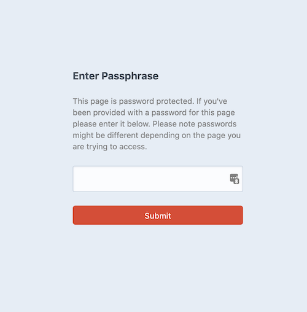

# Password Protection plugin for Craft CMS 3.x

Password protect any page on your Craft CMS site.

## Requirements

This plugin requires Craft CMS 3.0.0-beta.23 or later.

## Installation

To install the plugin, follow these instructions.

1. Open your terminal and go to your Craft project:

        cd /path/to/project

2. Then tell Composer to load the plugin:

        composer require imarc/craft-password-protection

3. In the Control Panel, go to Settings → Plugins and click the “Install” button for Password Protection.

## Password Protection Overview

This is a Craft CMS plugin that allows for password protecting any page in your CMS intuitively and without any hassle.

## Configuring Password Protection

WIP

## Using Password Protection

To start using Password Protection on a page simply login to the admin panel, then go to Entries and click the entry that you would like to protect. Once on the edit page on the right side of the screen you will see a lightswitch labeled 'Enable Password Protect'. Just toggle it on/off and enter a passphrase if you want that page protected. When you're done don't forget to click save in the top right and then you are ready to go!

Now when users go to that page they will get prompted with a password page

#### Note
Once a user enters a password correctly, a cookie will be stored and they won't have to re-enter the passphrase until the cookie expires(1 Day). Also any user that is logged in will automatically be granted access to ALL password protected pages. It's on the road map to allow customization of which users will be prompted on certain pages.

## Password Protection Roadmap

Some things to do, and ideas for potential features:

* Allow customization of which logged in users will be prompted for a password on certain pages
* Allow for customization of cookie duration
* Selecting of custom template for passphrase page

Brought to you by [Imarc](https://www.imarc.com/)
